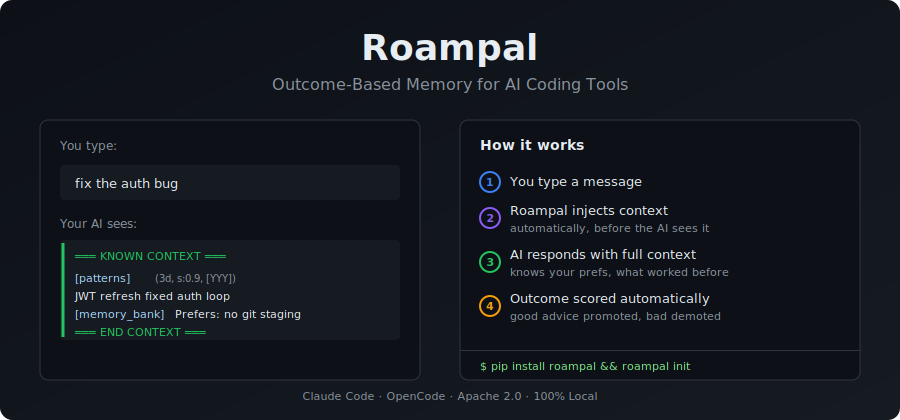
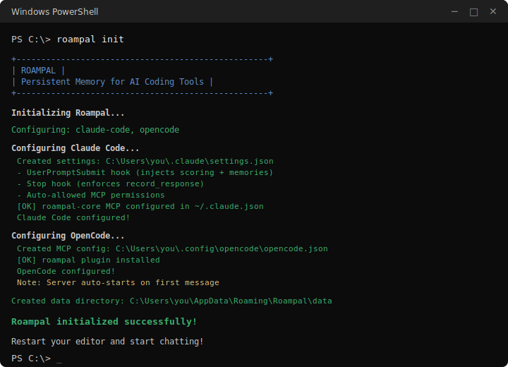

<p align="center">
  
</p>

<p align="center">
  <a href="https://pypi.org/project/roampal/"></a>
  <a href="https://pypi.org/project/roampal/"></a>
  <a href="https://github.com/roampal-ai/roampal-core/stargazers"></a>
  <a href="https://github.com/roampal-ai/roampal-core/blob/main/LICENSE"></a>
  <a href="https://www.python.org/downloads/"></a>
  <a href="https://discord.com/invite/F87za86R3v"></a>
</p>

<p align="center">
  <strong>Two commands. Your AI coding assistant gets outcome-based memory.</strong><br>
  Works with <strong>Claude Code</strong> and <strong>OpenCode</strong>.
</p>

---

## Why?

AI coding assistants forget everything between sessions. You explain your architecture, your preferences, your conventions — again. When they give bad advice, there's no mechanism to learn from it.

Roampal fixes this with outcome-based memory. Good advice gets promoted. Bad advice gets demoted. Your AI gets smarter every exchange, across every session.

---

## Quick Start

```bash
pip install roampal
roampal init
```

Auto-detects installed tools. Restart your editor and start chatting.

> Target a specific tool: `roampal init --claude-code` or `roampal init --opencode`

<p align="center">
  
</p>

<details>
<summary><strong>Platform Differences</strong></summary>

The core loop is identical — both platforms inject context, capture exchanges, and score outcomes. The delivery mechanism differs:

| | Claude Code | OpenCode |
|--|-------------|----------|
| Context injection | Hooks (stdout) | Plugin (system prompt) |
| Exchange capture | Stop hook | Plugin `session.idle` event |
| Scoring | Main LLM via `score_memories` tool | Independent sidecar (your chosen model > Zen free) |
| Self-healing | Hooks auto-restart server on failure | Plugin auto-restarts server on failure |

Claude Code prompts the main LLM to score each exchange via the `score_memories` tool. OpenCode uses an independent sidecar — a separate API call that reviews the exchange transcript as a third party, removing self-assessment bias. During `roampal init` or `roampal sidecar setup`, Roampal detects local models (Ollama, LM Studio, etc.) and lets you choose a scoring model. If configured, these take priority (Zen is skipped for privacy). A cheap or local model works great — scoring doesn't need a powerful model. Defaults to Zen free models (remote, best-effort) if you skip setup.
</details>

## How It Works

When you type a message, Roampal automatically injects relevant context before your AI sees it:

**You type:**
```
fix the auth bug
```

**Your AI sees:**
```
═══ KNOWN CONTEXT ═══
• JWT refresh pattern fixed auth loop [id:patterns_a1b2] (3d, 90% proven, patterns)
• User prefers: never stage git changes [id:mb_c3d4] (memory_bank)
═══ END CONTEXT ═══

fix the auth bug
```

No manual calls. No workflow changes. It just works.

### The Loop

1. **You type** a message
2. **Roampal injects** relevant context automatically (hooks in Claude Code, plugin in OpenCode)
3. **AI responds** with full awareness of your history, preferences, and what worked before
4. **Outcome scored** — good advice gets promoted, bad advice gets demoted
5. **Repeat** — the system gets smarter every exchange

### Five Memory Collections

| Collection | Purpose | Lifetime |
|------------|---------|----------|
| `working` | Current session context | 24h — promotes if useful, deleted otherwise |
| `history` | Past conversations | 30 days, outcome-scored |
| `patterns` | Proven solutions | Persistent while useful, promoted from history |
| `memory_bank` | Identity, preferences, goals | Permanent |
| `books` | Uploaded reference docs | Permanent |

## Commands

```bash
roampal init                # Auto-detect and configure installed tools
roampal init --claude-code  # Configure Claude Code explicitly
roampal init --opencode     # Configure OpenCode explicitly
roampal init --no-input     # Non-interactive setup (CI/scripts)
roampal start               # Start the HTTP server manually
roampal stop                # Stop the HTTP server
roampal status              # Check if server is running
roampal status --json       # Machine-readable status (for scripting)
roampal stats               # View memory statistics
roampal stats --json        # Machine-readable statistics (for scripting)
roampal doctor              # Diagnose installation issues
roampal summarize           # Summarize long memories (retroactive cleanup)
roampal score               # Score the last exchange (manual/testing)
roampal context             # Output recent exchange context
roampal ingest <file>       # Add documents to books collection
roampal books               # List all ingested books
roampal remove <title>      # Remove a book by title
roampal sidecar status      # Check scoring model configuration (OpenCode)
roampal sidecar setup       # Configure scoring model (OpenCode)
roampal sidecar disable     # Remove scoring model configuration (OpenCode)
```

## MCP Tools

Your AI gets these memory tools:

| Tool | Description | Platforms |
|------|-------------|-----------|
| `search_memory` | Deep search across all collections | Both |
| `add_to_memory_bank` | Store permanent facts (identity, preferences, goals) | Both |
| `update_memory` | Correct or update existing memories | Both |
| `delete_memory` | Remove outdated info | Both |
| `score_memories` | Score previous exchange outcomes | Both (see note) |
| `record_response` | Store key takeaways from significant exchanges | Both |

> **How scoring works:** Claude Code's hooks prompt the main LLM to call `score_memories` every turn. OpenCode uses an independent sidecar that scores silently in the background — the model never sees a scoring prompt and never calls `score_memories`. The tool is registered for both platforms but OpenCode's plugin handles all scoring independently. If the sidecar fails completely, the model is prompted to suggest `roampal sidecar setup`. Choose your scoring model during `roampal init` or via `roampal sidecar setup`.

## What's Different?

| Without Roampal | With Roampal |
|-----------------|--------------|
| Forgets everything between sessions | Remembers you, your preferences, what worked |
| You repeat context every time | Context injected automatically |
| No learning from mistakes | Outcomes tracked — bad advice gets demoted |
| No document memory | Ingest docs, searchable forever |

### Benchmarks

Tested across 10 adversarial scenarios designed to trick similarity search (200 total tests):

| Condition | Top-1 Accuracy |
|-----------|---------------|
| RAG baseline (vector search only) | 10% |
| + Cross-encoder reranking | 20% |
| **Full Roampal (outcomes + reranking)** | **10% → 60% at maturity** |

Outcome learning provides a **5x improvement** over reranking alone (+50 pts vs +10 pts). Roampal vs plain vector DB: **40% vs 0%** accuracy on adversarial queries (p=0.000135).

Full benchmark data: [`dev/benchmarks/results/`](dev/benchmarks/results/)

### How Roampal Compares

| Feature | Roampal Core | .cursorrules / CLAUDE.md | Mem0 |
|---------|-------------|--------------------------|------|
| Learns from outcomes | Yes — bad advice demoted, good advice promoted | No | No |
| Zero-config context injection | Yes — injected automatically (hooks or plugin) | Manual file editing | API calls required |
| Works across sessions | Yes — 5 memory collections with promotion | Per-project static files | Yes |
| Fully local / private | Yes — all data on your machine | Yes | Cloud or self-hosted |
| Open source | Apache 2.0 | N/A | Apache 2.0 |

<details>
<summary><strong>Architecture</strong></summary>

```
┌─────────────────────────────────────────────────────────┐
│  pip install roampal && roampal init                    │
│    Claude Code: hooks + MCP → ~/.claude/                │
│    OpenCode:    plugin + MCP → ~/.config/opencode/      │
└─────────────────────────────────────────────────────────┘
                         │
                         ▼
┌─────────────────────────────────────────────────────────┐
│  HTTP Hook Server (port 27182)                          │
│    Auto-started on first use, self-heals on failure     │
│    Manual control: roampal start / roampal stop         │
└─────────────────────────────────────────────────────────┘
                         │
                         ▼
┌─────────────────────────────────────────────────────────┐
│  User types message                                     │
│    → Hook/plugin calls HTTP server for context          │
│    → AI sees relevant memories, responds                │
│    → Exchange stored, scored (hooks or sidecar)         │
└─────────────────────────────────────────────────────────┘
                         │
                         ▼
┌─────────────────────────────────────────────────────────┐
│  Single-Writer Backend                                  │
│    FastAPI → UnifiedMemorySystem → ChromaDB             │
│    All clients share one server, isolated by session    │
└─────────────────────────────────────────────────────────┘
```

See [`dev/docs/`](dev/docs/) for full technical details.
</details>

## Requirements

- Python 3.10+
- One of: **Claude Code** or **OpenCode**
- **Platforms:** Windows, macOS, Linux (primarily developed and tested on Windows)

## Troubleshooting

<details>
<summary><strong>Hooks not working? (Claude Code)</strong></summary>

- Restart Claude Code (hooks load on startup)
- Check HTTP server: `curl http://127.0.0.1:27182/api/health`
</details>

<details>
<summary><strong>MCP not connecting? (Claude Code)</strong></summary>

- Verify `~/.claude.json` has the `roampal-core` MCP entry with correct Python path
- Check Claude Code output panel for MCP errors
</details>

<details>
<summary><strong>Context not appearing? (OpenCode)</strong></summary>

- Make sure you ran `roampal init --opencode`
- Check that the server auto-started: `curl http://127.0.0.1:27182/api/health`
- If not, start it manually: `roampal start`
</details>

<details>
<summary><strong>Server crashes and recovers?</strong></summary>

This is expected. Roampal has self-healing -- if the HTTP server stops responding, it is automatically restarted and retried.
</details>

**Still stuck?** Ask your AI for help — it can read logs and debug Roampal issues directly.

## Support

Roampal Core is completely free and open source.

- Support development: [roampal.gumroad.com](https://roampal.gumroad.com/l/aagzxv)
- Feature ideas & feedback: [Discord](https://discord.com/invite/F87za86R3v)
- Bug reports: [GitHub Issues](https://github.com/roampal-ai/roampal-core/issues)

## License

[Apache 2.0](LICENSE)
