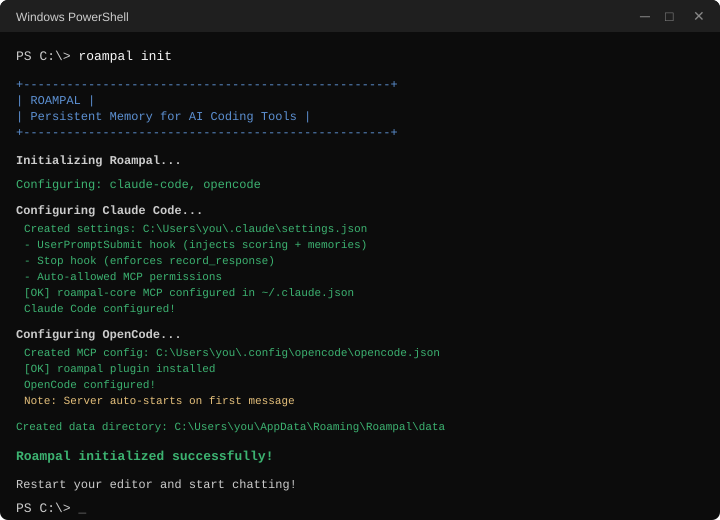

<h1 align="center">roampal-core</h1>

<p align="center"><strong>Outcome-Based Persistent Memory MCP Server</strong></p>

<p align="center">
  <a href="https://github.com/roampal-ai/roampal-core/actions/workflows/tests.yml"></a>
  <a href="https://pypi.org/project/roampal/"></a>
  <a href="https://github.com/roampal-ai/roampal-core/releases/latest"></a>
  <a href="https://pypi.org/project/roampal/"></a>
  <a href="https://github.com/roampal-ai/roampal-core/stargazers"></a>
  <a href="https://github.com/roampal-ai/roampal-core/blob/main/LICENSE"></a>
  <a href="https://www.python.org/downloads/"></a>
  <a href="https://discord.com/invite/F87za86R3v"></a>
</p>

<p align="center">
  <strong>Two commands. Your AI coding assistant gets outcome-based memory.</strong><br>
  Works with <strong>Claude Code</strong> and <strong>OpenCode</strong>.
</p>

---

## Benchmarks

**85.8% on the corrected LoCoMo benchmark** (non-adversarial, end-to-end answer accuracy) — validated on 1,986 questions across 10 conversations with dual grading. All figures in this section are sourced from the paper and [roampal-labs](https://github.com/roampal-ai/roampal-labs) (see citations at the bottom of this section).

| Result | Score |
|--------|-------|
| Conversational learning vs raw ingestion | **+23 points** (76.6% vs 53.0%, p<0.0001) |
| Architecture vs model effect | Architecture **~10x larger** contributor |
| Poison resilience (1,135 adversarial memories) | **-2.6 to -4.2 points** only |
| TagCascade retrieval (tags-first + CE rerank) | **+1.9 Hit@1** vs pure CE (p<0.0001) |

Benchmark pipeline runs on a single GPU with no cloud dependencies. Roampal itself runs on CPU — no GPU required. Full methodology, data, and evaluation scripts: [roampal-labs](https://github.com/roampal-ai/roampal-labs)

Paper: *"Beyond Ingestion: What Conversational Memory Learning Reveals on a Corrected LoCoMo Benchmark"* (Logan Teague, April 2026)

---

## Quick Start

```bash
pip install roampal
roampal init
```

Auto-detects installed tools. Restart your editor and start chatting.

> Target a specific tool: `roampal init --claude-code` or `roampal init --opencode`

<p align="center">
  
</p>

<details>
<summary><strong>Platform Differences</strong></summary>

The core loop is identical — both platforms inject context, capture exchanges, and score outcomes. The delivery mechanism differs:

| | Claude Code | OpenCode |
|--|-------------|----------|
| Context injection | Hooks (stdout) | Plugin (system prompt) |
| Exchange capture | Stop hook | Plugin `session.idle` event |
| Scoring | Main LLM via `score_memories` tool | Independent sidecar (your chosen model, disabled by default until configured) |
| Self-healing | Hooks auto-restart server on failure | Plugin auto-restarts server on failure |

Claude Code prompts the main LLM to score each exchange via the `score_memories` tool. OpenCode never self-scores — an independent sidecar (a separate API call) reviews each exchange as a third party, removing self-assessment bias. The `score_memories` tool is not registered on OpenCode. Scoring is disabled by default until you explicitly configure it via `roampal sidecar setup`. During setup, Roampal detects local models (Ollama, LM Studio, etc.) and lets you choose a scoring model. Zen free models are available as an explicit opt-in choice for users without a local model or API key — they route through OpenCode's proxy which may log data. A cheap or local model works great — scoring doesn't need a powerful model.

> **v0.6.0:** Server lifecycle + per-directory profile binding + a dedup safety net. The 4,700-line `roampal/cli.py` monolith is now a `roampal/cli/` package split into per-domain modules, guarded by golden-output snapshots, dispatch-table invariants, and a byte-identical equivalence suite. User-visible changes on top: per-request profile routing (hooks/MCP/plugin always name their profile; an unregistered name now fails explicitly with a "Create it first" 404 instead of silently writing to the default store); `roampal profile switch` no longer kills the running server (every session picks the new profile up on its next exchange); spawned servers run with `-E [-P]` isolation and a neutral cwd (a project containing a local `roampal/` directory can no longer shadow the install — and user-site installs, e.g. Microsoft Store Python, work again — an earlier draft of this spawn hardening used the isolated `-I` flag, which also hides the user site-packages directory); `status` reports a hanging port as stopped, not error; shared servers retire themselves after 30 idle minutes (a foreground `roampal start` is exempt); and `roampal start --profile X` survives idle respawn via a persisted launch pin. New `roampal profile bind <name>` / `unbind` pin a directory (and its subdirectories) to a profile — "this project always uses profile X" is one command instead of hand-editing env JSON. A dedup regression guard test (3 distinct facts through the real `store_memory_bank` path, plus recorded real-model vectors and a negative control that re-creates the v0.5.9 broken regime both ways) makes any future embedder swap or distance-constant change fail the suite at the first touch instead of silently collapsing writes. **Privacy fix (OpenCode):** since v0.3.7 the OpenCode plugin sent exchange text to Zen (opencode.ai) whenever no scoring model was chosen — including after "Skip" and `roampal sidecar disable` — breaking v0.5.3's "nothing leaves your machine without an explicit choice" rule, which had only been applied server-side. v0.6.0 enforces it in the plugin: Zen only after an explicit opt-in, and no scoring calls at all until a model is chosen. If you use OpenCode and never picked a scoring model, scoring is now off until you run `roampal sidecar setup` (or `--list` to choose without the menu). No RAM change — the v0.5.9 footprint and model state carry over unchanged.
>
> **v0.5.9:** Memory footprint fix + embedder/reranker upgrade + crash observability — triggered by a `MemoryError` crash traced to ONNX Runtime's CPU memory arena never releasing per-shape scratch buffers, compounded by FP16 model files up-converting to FP32 at load. Disables the arena and mem-pattern cache on both models, switches the embedder to its own measured INT8 export (same mpnet model — the planned e5-base upgrade was held back to v0.6.0 after an accuracy gate caught a near-duplicate-guard regression) and the cross-encoder to its own INT8 export, and shares one cross-encoder session across all profiles instead of one per profile. Measured process footprint drops from ~2,355MB to ~484MB in isolation (~5x), and search gets faster on both the embed and rerank paths rather than trading memory for latency. A background, per-collection re-embed migrates existing vectors to the new embedder automatically on first start — never blocking the MCP client, never mixing model families within a collection. Also adds file-based logging, MemoryError/ExceptionGroup handling, an RSS heartbeat, and a `/api/status` endpoint so the next incident like this one leaves a trace, and degraded states (embedder down, reranker down, migration in progress) are surfaced to the user instead of silently returning an empty result.
>
> **v0.5.8:** Crash-resilience release — enables SQLite WAL + FULL durability on the ChromaDB catalog so hard terminations (Windows port conflicts, external process kills, power loss) no longer corrupt or empty the database. Rewrites `SessionManager.mark_scored()` to perform an atomic temp-file replace, guaranteeing the JSONL transcript survives a crash mid-write. Also ships 16 new automated tests covering both fixes, fixes pre-existing test debt that left the full suite red on Windows, and adds dev tooling (`pytest-timeout`, `pytest-forked`, `build`, `twine`). No data migration required; WAL is applied on the next server start.
>
> **v0.5.7:** Startup garbage collection for the MCP hook's `_completion_state.json`. The file accumulated one entry per `conversation_id` ever seen with no cleanup, driving I/O amplification on every write and leaving stuck `scored_this_turn=True` flags that could poison the cross-session scoring fallback. New `_cleanup_completion_state` pass drops entries older than 30 days or with no matching transcript, enforces a 500-entry hard ceiling, and writes atomically. JSONL transcript TTL bumped 7 → 30 days to stay in lockstep with the state-file TTL. Ships paired with Roampal Desktop v0.3.3.
>
> **v0.5.6:** Hardening release — closes remaining coverage gaps from the v0.5.5.x verification audit. Phantom sweep after archived cleanup, auto-cleanup under capacity pressure, dedup observability, hardened delete permissions, archive-then-add cycle tests, sidecar prompt alignment with benchmark, async scoring queue (per-session deferred retry), MCP tool definition quality rewrite (TDQS), OpenCode Go auto-detect in sidecar setup wizard, and user name extraction fix.
>
> **v0.5.5.2:** Hotfix — Windows plugin install now verifies copy succeeded (post-copy size check + manual read/write fallback for OneDrive/antivirus interference). Also installs to `%APPDATA%\opencode\plugins` as fallback since some Electron apps resolve config paths differently on Windows. Fixes remaining cases of issue #11 where `roampal init --force` reported success but the plugin was empty or in the wrong directory.
>
> **v0.5.5.1:** Hotfix — OpenCode Desktop now correctly switches profiles when you switch projects in the UI (issue #10). Plugin reads the active session's `directory` via `client.session.get()` instead of caching the profile at module load, so a singleton plugin across a multi-project workspace still hits the right profile per message. Also: `roampal init --force` actually overwrites the OpenCode plugin file now (issue #11), with clearer errors when Desktop holds a file lock.
>
> **v0.5.5:** Soft-delete for memory_bank — ChromaDB hard delete doesn't actually remove vectors from HNSW, causing phantom dedup matches that block new memories after GUI deletion. Replaced with `status=archived` metadata update plus status filter on all query/dedup paths. Also: scoring mutex → async queue (eliminates dropped requests), sidecar summary contamination fix (delimiter fencing).
>
> **v0.5.4:** Profile binding is now per-request, not per-process. Every client (MCP server, OpenCode plugin, Python hooks for Claude Code / Cursor) sends an `X-Roampal-Profile` header so a single FastAPI server can cleanly serve multiple profiles simultaneously. Fixes issue #7 where OpenCode Desktop's per-project `ROAMPAL_PROFILE` in `opencode.json` was ignored because the singleton FastAPI bound the profile once at startup.
>
> **v0.5.3:** Sidecar scoring now requires explicit configuration (no automatic fallback to Zen or localhost). Small local models (qwen2.5:3b, etc.) that return bare JSON arrays instead of OpenAI-shaped responses are handled transparently via server-side shape tolerance.
</details>

## How It Works

When you type a message, Roampal automatically injects relevant context before your AI sees it:

**You type:**
```
fix the auth bug
```

**Your AI sees:**
```
═══ KNOWN CONTEXT ═══
• JWT refresh pattern fixed auth loop [id:patterns_a1b2] (3d, 90% proven, patterns)
• User prefers: never stage git changes [id:mb_c3d4] (memory_bank)
═══ END CONTEXT ═══

fix the auth bug
```

No manual calls. No workflow changes. It just works.

### The Loop

1. **You type** a message
2. **Roampal injects** relevant context automatically (hooks in Claude Code, plugin in OpenCode)
3. **AI responds** with full awareness of your history, preferences, and what worked before
4. **Outcome scored** — good advice gets promoted, bad advice gets demoted
5. **Repeat** — the system gets smarter every exchange

### Five Memory Collections

| Collection | Purpose | Lifetime |
|------------|---------|----------|
| `working` | Current session context | 24h — promotes if useful, deleted otherwise |
| `history` | Past conversations | 30 days, outcome-scored |
| `patterns` | Proven solutions | Persistent while useful, promoted from history |
| `memory_bank` | Identity, preferences, goals | Permanent |
| `books` | Uploaded reference docs | Permanent |

## Commands

```bash
roampal init                # Auto-detect and configure installed tools
roampal init --claude-code  # Configure Claude Code explicitly
roampal init --opencode     # Configure OpenCode explicitly
roampal init --no-input     # Non-interactive setup (CI/scripts)
roampal start               # Start the HTTP server manually
roampal stop                # Stop the HTTP server
roampal status              # Check if server is running
roampal status --json       # Machine-readable status (for scripting)
roampal stats               # View memory statistics
roampal stats --json        # Machine-readable statistics (for scripting)
roampal doctor              # Diagnose installation issues
roampal summarize           # Summarize long memories (retroactive cleanup)
roampal context             # Output recent exchange context
roampal ingest <file>       # Add documents to books collection
roampal books               # List all ingested books
roampal remove <title>      # Remove a book by title
roampal sidecar status      # Check scoring model configuration (OpenCode)
roampal sidecar setup       # Configure scoring model (OpenCode)
roampal sidecar test        # Test scoring model response format (OpenCode)
roampal retag               # Re-extract tags on memories using sidecar LLM
roampal sidecar disable     # Disable scoring (removes config, retrieval still works)

# Choose a scoring model without the menu (v0.6.0) — for scripts and AI-driven installs.
# Ask the user first: the choice decides where exchange text is sent.
roampal sidecar setup --list [--json]                  # Every choice, where its data goes, the command that selects it
roampal sidecar setup --model qwen3:1.7b               # A detected local/API model (name from --list)
roampal sidecar setup --auto                           # The recommended detected LOCAL model (never cloud or paid)
roampal sidecar setup --url <base_url> --model <name> --key-env <ENV_VAR>   # Custom endpoint; key read from an env var
roampal sidecar setup --go <model>                     # OpenCode Go
roampal sidecar setup --zen                            # Opt in to free Zen cloud models (data sent to opencode.ai)

# Sidecar scope flags (v0.5.3+) — OpenCode merges project-local over user-global config:
roampal sidecar setup --scope user       # Write only to user-global config (~/.config/opencode/)
roampal sidecar setup --scope project    # Write only to project-local opencode.json in cwd ancestry
roampal sidecar setup                    # Auto-detects: uses project-local if shadow exists, otherwise user-global

# Sidecar scope flags for disable (v0.5.3+):
roampal sidecar disable --scope user       # Clear only from user-global config
roampal sidecar disable --scope project    # Clear only from project-local opencode.json
roampal sidecar disable                    # Auto-detects scope same as setup

# Named memory profiles (v0.5.1) — isolate memory per project, per client, etc.
roampal profile list                         # List registered profiles
roampal profile show                         # Show active profile and its path
roampal profile create <name>                # Create auto-located profile
roampal profile register <name> --path <dir> # Register an existing directory
roampal profile use <name>                   # Persist as user-global default
roampal profile unuse                        # Clear persistence
roampal profile switch <name>                # Persist as active (no server kill — sessions pick it up on the next exchange)
roampal profile delete <name>                # Remove from registry (cascades directory bindings)
roampal profile bind <name>                  # Bind cwd directory to profile (v0.6.0)
roampal profile bind <name> --path <dir>     # Bind a specific directory
roampal profile unbind --path <dir>          # Remove a binding
roampal reembed                              # Re-embed vectors after an embedder model change (v0.5.9+)
roampal help                                 # Show the command help
roampal start --profile <name>               # Launch with a default profile: sessions with nothing configured (hook/MCP resolve the launch pin explicitly) route there; survives idle respawn; cleared by bare start/stop
```

## Named Memory Profiles (v0.5.1)

Run separate memory stores for different contexts — per project, per client (Claude Code vs OpenCode), work vs home. Profiles are managed entirely through the CLI; no config files to hand-edit.

```bash
roampal profile create work          # auto-located at <appdata>/Roampal/data/work/
roampal profile switch work          # persist as active
# sessions without their own explicit profile config pick 'work' up on the next exchange
```

Register an existing directory as a profile (no data migration):

```bash
roampal profile register project-a --path /existing/custom/path
```

**Precedence** (highest wins; env/config tiers are per-shell and config-file scoped, the binding is a directory property):
1. `--profile <name>` flag
2. `ROAMPAL_PROFILE=<name>` env var (set per-project in `opencode.json` or `.claude.json` `env: {}`)
3. Directory binding (v0.6.0) — `roampal profile bind work` pins the current directory (and all subdirectories) to profile `work`; the walk goes up from your cwd and the closest bound directory wins. One command per project, but not the whole setup: any `ROAMPAL_PROFILE` env var set for that project's config still wins over the binding
4. `roampal profile use <name>` persisted default
5. `"default"` fallback

Sessions always name the profile they resolve to — an explicit header, a project's cwd directory, or a persisted default — and the shared server never guesses a profile from its own working directory or environment.

## MCP Tools

Your AI gets these memory tools:

| Tool | Description | Platforms |
|------|-------------|-----------|
| `search_memory` | Deep search across all collections | Both |
| `add_to_memory_bank` | Store permanent facts (identity, preferences, goals) | Both |
| `update_memory` | Correct or update existing memories | Both |
| `delete_memory` | Remove outdated info | Both |
| `score_memories` | Score previous exchange outcomes | Claude Code |
| `record_response` | Store key takeaways from significant exchanges | Both |

> **How scoring works:** Claude Code's hooks prompt the main LLM to call `score_memories` every turn. OpenCode uses an independent sidecar that scores silently in the background — the model never sees a scoring prompt and `score_memories` is not registered as a tool. If the sidecar is unavailable, a warning prompts the user to run `roampal sidecar setup`. Choose your scoring model during `roampal init` or via `roampal sidecar setup`.

## How Roampal Compares

| Feature | Roampal Core | Claude Code built-in (CLAUDE.md / auto memory) | OpenCode built-in |
|---------|-------------|--------------------------------------------------|-------------------|
| Learns from outcomes | Yes — bad advice demoted, good advice promoted | No | No |
| Semantic retrieval | Yes — TagCascade + cross-encoder reranking | No — files loaded in full, no search | No memory system |
| Context injection | Automatic — relevant memories per query | Full CLAUDE.md every session, auto memory on demand | None |
| Atomic fact extraction | Yes — summaries + facts, two-lane retrieval | No — saves what Claude decides is useful | No |
| Works across projects | Yes — shared memory across all projects | Per-project only (per git repo) | No memory |
| Scales with history | Yes — 5 collections, promotion/demotion/decay | CLAUDE.md unbounded, auto memory first 200 lines | No memory |
| Fully local / private | Yes — ChromaDB on your machine | Yes | Yes |

<details>
<summary><strong>Architecture</strong></summary>

```
┌─────────────────────────────────────────────────────────┐
│  pip install roampal && roampal init                    │
│    Claude Code: hooks + MCP → ~/.claude/                │
│    OpenCode:    plugin + MCP → ~/.config/opencode/      │
└─────────────────────────────────────────────────────────┘
                         │
                         ▼
┌─────────────────────────────────────────────────────────┐
│  HTTP Hook Server (port 27182)                          │
│    Auto-started on first use, self-heals on failure     │
│    Manual control: roampal start / roampal stop         │
└─────────────────────────────────────────────────────────┘
                         │
                         ▼
┌─────────────────────────────────────────────────────────┐
│  User types message                                     │
│    → Hook/plugin calls HTTP server for context          │
│    → AI sees relevant memories, responds                │
│    → Exchange stored, scored (hooks or sidecar)         │
└─────────────────────────────────────────────────────────┘
                         │
                         ▼
┌─────────────────────────────────────────────────────────┐
│  Single-Writer Backend                                  │
│    FastAPI → UnifiedMemorySystem → ChromaDB             │
│    All clients share one server, isolated by session    │
└─────────────────────────────────────────────────────────┘
```

See [`dev/docs/`](dev/docs/) for full technical details.
</details>

## Requirements

- Python 3.10+ (3.13 supported; 3.11+ gets the full `-P` launch protection — on 3.10 the neutral launch folder alone guards against a project `roampal/` shadowing the install. Note: Python 3.10 reaches end-of-life in October 2026)
- One of: **Claude Code** or **OpenCode**
- **Platforms:** Windows, macOS, Linux (macOS and Python 3.13 are CI-tested as of v0.6.0; primarily developed on Windows)
- **RAM:** ~500MB available (cross-encoder reranker + embeddings + ChromaDB); first-run migration after an upgrade adds no meaningful spike
- **Disk:** ~500MB for models (multilingual embedding + reranker, downloaded automatically on first use)
- **CPU:** Any modern x86-64 processor with AVX2 (Intel Haswell 2013+ / AMD Excavator 2015+)
- **GPU:** Not required — all inference runs on CPU via ONNX Runtime

## Troubleshooting

<details>
<summary><strong>Hooks not working? (Claude Code)</strong></summary>

- Restart Claude Code (hooks load on startup)
- Check HTTP server: `curl http://127.0.0.1:27182/api/health`
</details>

<details>
<summary><strong>MCP not connecting? (Claude Code)</strong></summary>

- Verify `~/.claude.json` has the `roampal-core` MCP entry with correct Python path
- Check Claude Code output panel for MCP errors
</details>

<details>
<summary><strong>Context not appearing? (OpenCode)</strong></summary>

- Make sure you ran `roampal init --opencode`
- Check that the server auto-started: `curl http://127.0.0.1:27182/api/health`
- If not, start it manually: `roampal start`
</details>

<details>
<summary><strong>Server crashes and recovers?</strong></summary>

This is expected. Roampal has self-healing -- if the HTTP server stops responding, it is automatically restarted and retried.
</details>

**Still stuck?** Ask your AI for help — it can read logs and debug Roampal issues directly.

## Support

Roampal Core is completely free and open source.

- Support development: [roampal.gumroad.com](https://roampal.gumroad.com/l/aagzxv)
- Feature ideas & feedback: [Discord](https://discord.com/invite/F87za86R3v)
- Bug reports: [GitHub Issues](https://github.com/roampal-ai/roampal-core/issues)
- Need help with AI memory? Reach out: **roampal@protonmail.com** | [LinkedIn](https://www.linkedin.com/in/logan-teague-6909901a5/)

<p align="center">
  <a href="https://glama.ai/mcp/servers/roampal-ai/roampal-core"></a>
</p>

## License

[Apache 2.0](LICENSE)
